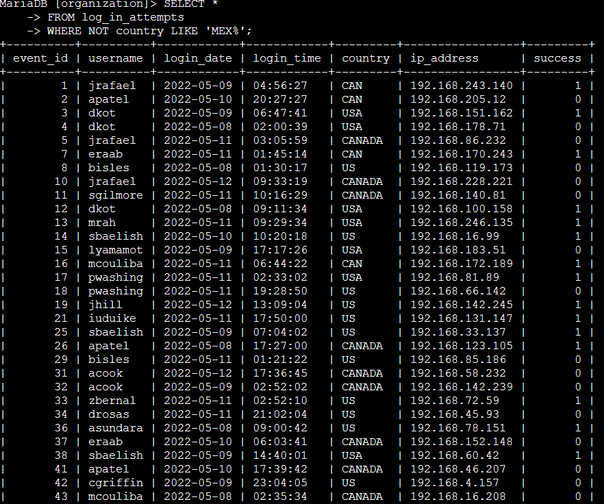
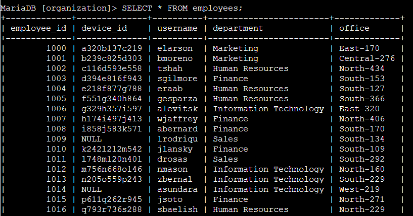
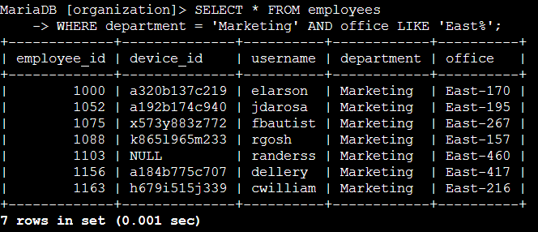
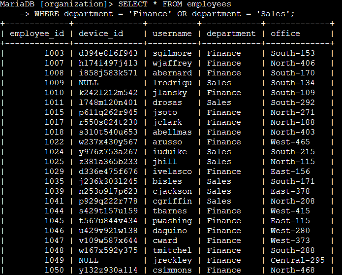
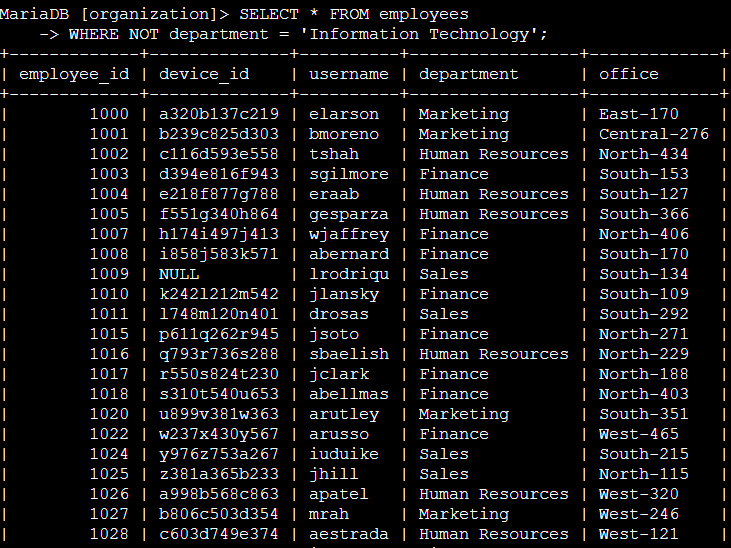

# Project Description 
In this lab activity, I worked as a security analyst investigating potential security issues using SQL. The goal was to analyze login attempts and employee data to identify suspicious activity and determine which systems might require further security review or updates. 

Using SQL queries, I filtered login records based on time, date, and location, and queries employee information based on department and office location. This project helped me practice how SQL is used in real world security investigations and reinforced how filtering data can support incident response and access management. 

# Task 1: Retrieve After Hours Failed Login Attempts 
In this task, I investigated failed login attempts that occurred after normal business hours. Since office hours end at 18:00, login attempts made after that time may indicate suspicious activity.

To identify these events, I queried the `log_in_attempts` table and filtered the data based on the time of the login attempt and whether the login was successful.

## Explanation 
The condition `login_time > '18:00'` filters the results to only include login attempts that occurred after business hours.

The condition `success = FALSE` filters for failed login attempts. In MySQL and MariaDB, Boolean values are stored as `TRUE` or `FALSE`, which are represented internally as `1` and `0`. Using `FALSE` allows me to specifically retrieve unsuccessful login attempts. 

The `AND` operator ensures that both conditions must be true for a record to be returned. As a result, the query only shows failed login attempts that occurred after 18:00. 

# Task 2: Retrieve Login Attempts on Specific Dates
In this task, I investigated login attempts related to a suspicious event that occurred on `2022-05-09`. To get more context around this activity, I retrieved all login attempts that occurred on that day and the day before, `2022-05-08`.

To complete this task, I queried the `log_in_attempts` table and filtered the results based on the `login_date` column.

## Explanation 
The condition `login_date = '2022-05-09'` filters the data to include login attempts that occurred on the day the suspicious event was reported.

The condition `login_date = '2022-05-08'` included login attempts from the day before, which helps provide additional context leading up to the event. 

The `OR` operator is used so that login attempts from **either date** are returned. This allows the query to capture activity across both days instead od limiting the results to just one. 

By using this query, I was able to review all login activity surrounding the suspicious event and better understand what occurred before and during that time period. 

# Task 3: Retrieve Login Attempts Outside of Mexico

In this task, I investigated login attempts that did not originate in Mexico. The security team determined that recent suspicious activity came from locations outside of Mexico, so the goal was to exclude any login attempts that originated there. 

The `country` column contains values such as `MEX` and `MEXICO`, so I needed to account for both variations when filtering the data.

## Explanation 
The condition `country LIKE 'MEX%'` matches any country value that starts with `MEX`, including both `MEX` and `MEXICO`. The `%` wildcard allows the query to match any additional characters after `MEX`. 

The `NOT` operator is used to exclude those results. This means the query returns only login attempts that did not originate in Mexico. 

By combining `NOT` with `LIKE`, I was able to filter out all login attempts from Mexico and focus on activity coming from other countries, which helped narrow down the investigation. 

# Task 4: Retrieve Employees in the Marketing Department (East Building)
In this task, I needed to identify employees in the Marketing department whose machines require updates. The focus was on employees located in offices in the East building. 

To understand the available data, I first reviewed all columns and values in the `employees` table. This helped confirm how departments and office locations were formatted. 

## Explanation 
The condition `department = 'Marketing'` filters the results to only include employees who work in the Marketing department. 

The condition `office LKE 'East'` filters for office locations that start with `East`. The `%` wildcard allows the query to match all East building offices, such as `East-170`, `East-195`, and `East-320`.

The `AND` operator ensures that both conditions must be true. This means the query only returns employees who are in the Marketing department **and** are located in the East building. 

Using this query allowed me to identify which Marketing employee machines in the East building require security updates. 

# Task 5: Retrieve Employees in the Finance or Sales Departments 
In this task, I identified employees whose computers require a different type of security update. The focus was on employees working in the Finance or Sales departments. 

To complete this task, I queried the `employees` table and filtered the results based on the department each employee belongs to. 

## Explanation 
The condition `department` = 'Finance' filters the results to include employees in the Finance department. 

The condition `department = 'Sales'` filters the results to include employees in the Sales department. 

The `OR` operator is used so that employees who belong to either department are returned. Even though both conditions use the same column, each condition must be written out fully for the query to work correctly.

This query allowed me to identify all employees in the Finance and Sales departments whose machines require the specified security update. 

# Task 6: Retrieve All Employees Not in Information Technology 
In this task, I identified employees whose computers still need a security update. Employees in the Information Technology department already received this update, so the goal was to retrieve information for all employees who are **not** in that department. 

To complete this task, I queried the `employees` table and excluded records where the department was Information Technology.

## Explanation 
The condition `department = Information Technology` identifies employees who work in the IT department. 

The `NOT` operator is used to exclude those employees from the results. This means the query returns all employees who belong to departments other than Information Technology. 

Using this query allowed me to identify which employees still need the security update, since the update had already been applied to IT department machines. 

# Summary 
In this project, I used SQL to investigate login activity and employee data as part of a simulated security investigation. I practiced filtering data using `AND`, `OR`, `NOT`, and `LIKE` to analyze login attempts based on time, date, and location, and to identify employees who required different security updates. This project helped me better understand how SQL is used in real world security scenarios and improved my ability to analyze data in a structured and logical way. 