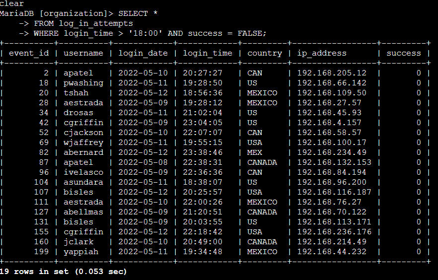
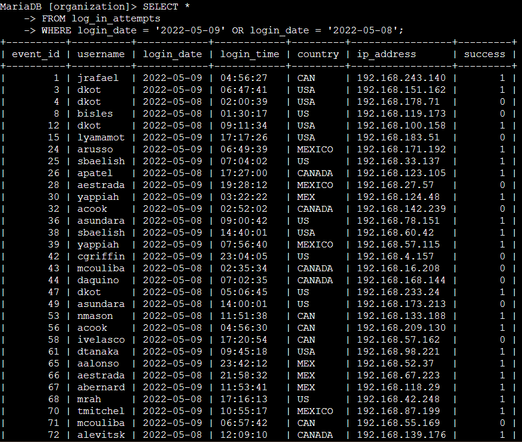

# Project Description 
In this lab activity, I worked as a security analyst investigating potential security issues using SQL. The goal was to analyze login attempts and employee data to identify suspicious activity and determine which systems might require further security review or updates. 

Using SQL queries, I filtered login records based on time, date, and location, and queries employee information based on department and office location. This project helped me practice how SQL is used in real world security investigations and reinforced how filtering data can support incident response and access management. 

# Task 1: Retrieve After Hours Failed Login Attempts 
In this task, I investigated failed login attempts that occurred after normal business hours. Since office hours end at 18:00, login attempts made after that time may indicate suspicious activity.

To identify these events, I queried the `log_in_attempts` table and filtered the data based on the time of the login attempt and whether the login was successful.

## Explanation 
The condition `login_time > '18:00'` filters the results to only include login attempts that occurred after business hours.

The condition `success = FALSE` filters for failed login attempts. In MySQL and MariaDB, Boolean values are stored as `TRUE` or `FALSE`, which are represented internally as `1` and `0`. Using `FALSE` allows me to specifically retrieve unsuccessful login attempts. 

The `AND` operator ensures that both conditions must be true for a record to be returned. As a result, the query only shows failed login attempts that occurred after 18:00. 

# Task 2: Retrieve Login Attempts on Specific Dates
In this task, I investigated login attempts related to a suspicious event that occurred on `2022-05-09`. To get more context around this activity, I retrieved all login attempts that occurred on that day and the day before, `2022-05-08`.

To complete this task, I queried the `log_in_attempts` table and filtered the results based on the `login_date` column.

## Explanation 
The condition `login_date = '2022-05-09'` filters the data to include login attempts that occurred on the day the suspicious event was reported.

The condition `login_date = '2022-05-08'` included login attempts from the day before, which helps provide additional context leading up to the event. 

The `OR` operator is used so that login attempts from **either date** are returned. This allows the query to capture activity across both days instead od limiting the results to just one. 

By using this query, I was able to review all login activity surrounding the suspicious event and better understand what occurred before and during that time period. 

# Task 3: Retrieve Login Attempts Outside of Mexico

In this task, I investigated login attempts that did not originate in Mexico. The security team determined that recent suspicious activity came from locations outside of Mexico, so the goal was to exclude any login attempts that originated there. 

The `country` column contains values such as `MEX` and `MEXICO`, so I needed to account for both variations when filtering the data.
